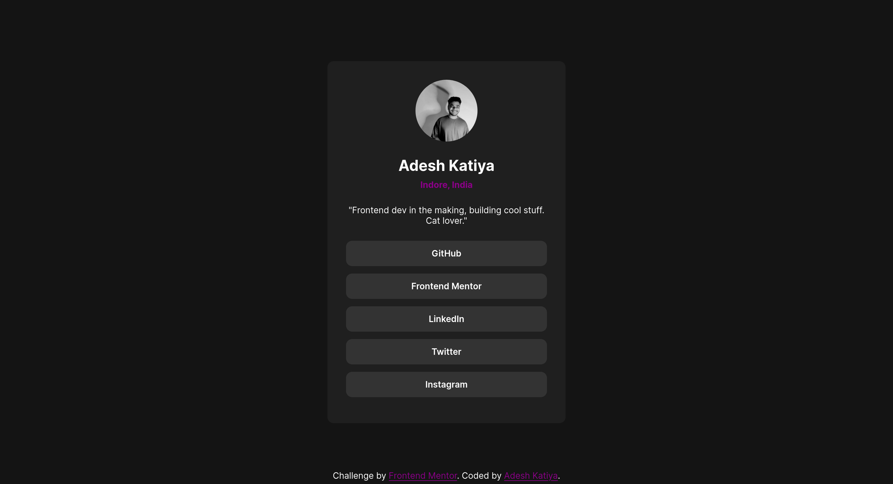

# Frontend Mentor - Social links profile solution

This is a solution to the [Social links profile challenge on Frontend Mentor](https://www.frontendmentor.io/challenges/social-links-profile-UG32l9m6dQ). Frontend Mentor challenges help you improve your coding skills by building realistic projects.

## Table of contents

- [Overview](#overview)
  - [The challenge](#the-challenge)
  - [Screenshot](#screenshot)
  - [Links](#links)
- [My process](#my-process)
  - [Built with](#built-with)
  - [What I learned](#what-i-learned)
  - [Continued development](#continued-development)
  - [Useful resources](#useful-resources)

**Note: Delete this note and update the table of contents based on what sections you keep.**

## Overview

### The challenge

Users should be able to:

- See hover and focus states for all interactive elements on the page

### Screenshot

### Links

- Solution URL: [Social Links profile](https://www.frontendmentor.io/solutions/social-links-profile-using-html-and-css-n4CZU4EZzl)
- Live Site URL: [Social Links profile](https://social-links-profile-main-three-silk.vercel.app/)

## My process

### Built with

- Semantic HTML5 markup
- CSS custom properties
- Flexbox

### What I learned

- Learned about guessing the sizes through design pictures provided.

- Learned about how I can layout elements from top-to-bottom without fixing the container lenghts like width and height.

### Continued development

- I get confused about structuring the depth of the elements in the design and make it complex which I want to avoid from now on.

### Useful resources

- [Google](https://www.google.com)
